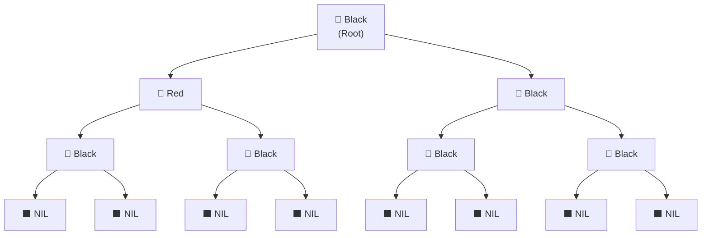
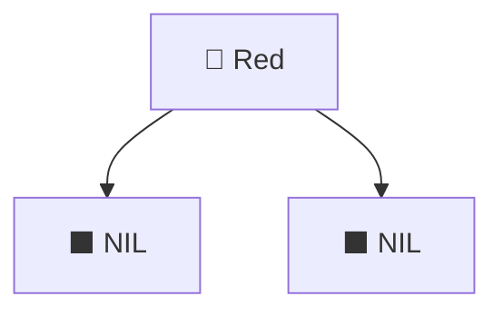
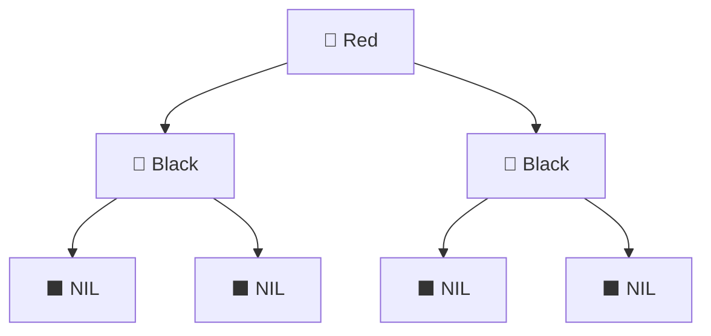
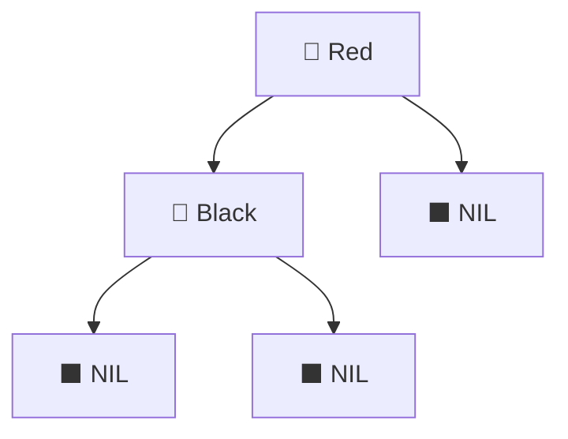
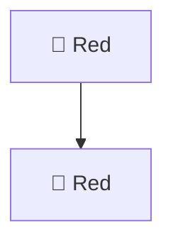
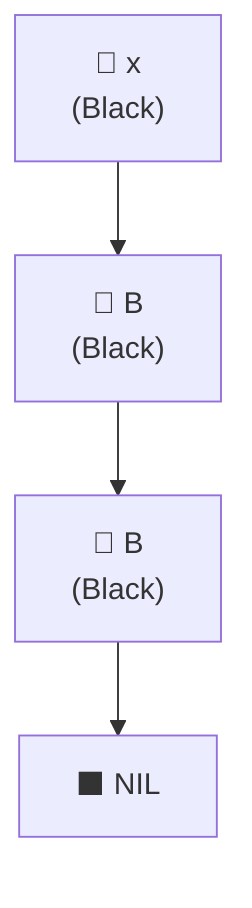
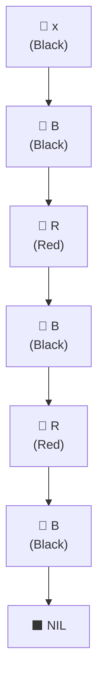
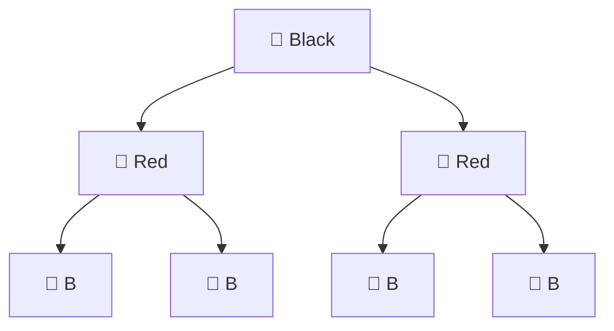
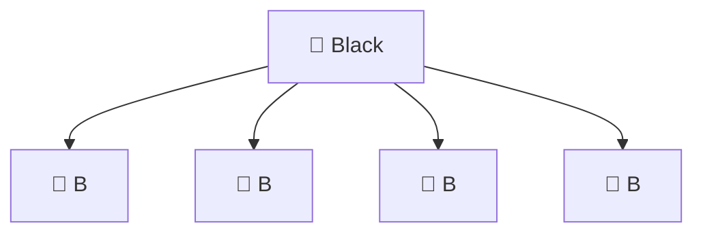

<blockquote>
📊 <strong>Prefer slides?</strong> Check out the interactive presentation: <a href="https://rbtree.slides.mamood.ir/">Red–Black Trees Slides</a>
</blockquote>

## Motivation

A **binary search tree (BST)** stores keys so that for each internal node $ x $:

- All keys in the left subtree of $ x $ are smaller than `key(x)`.
- All keys in the right subtree of $ x $ are larger than `key(x)`.

BST operations have running time proportional to the **height** $ h $ of the tree:

- Search: $ \Theta(h) $
- Insert: $ \Theta(h) $
- Delete: $ \Theta(h) $

In the worst case (for example, inserting already sorted keys into an empty tree), a BST degenerates into a chain and $ h = \Theta(n) $. To avoid this, we use **balanced** search trees.

A small comparison:

| Data Structure     | Search                       | Insert                       | Delete                       | Height                    | Notes                                     |
|--------------------|------------------------------|------------------------------|------------------------------|---------------------------|-------------------------------------------|
| Unbalanced BST     | $ O(\log n) $ avg, $ O(n) $ worst | same                         | same                         | Up to $ n $               | Can degrade to a linked list             |
| AVL Tree           | $ O(\log n) $                | $ O(\log n) $                | $ O(\log n) $                | Strictly balanced         | Stricter height invariants               |
| **Red–Black Tree** | $ O(\log n) $                | $ O(\log n) $                | $ O(\log n) $                | $ \le 2\log_2(n+1) $      | Relaxed balancing, few rotations         |
| Treap              | Expected $ O(\log n) $       | Expected $ O(\log n) $       | Expected $ O(\log n) $       | Expected $ O(\log n) $    | Randomized priorities                    |

Red–black trees guarantee logarithmic height via **color-based invariants** instead of strict height balancing.

---

## Structural Conventions

To be precise, we fix conventions compatible with CLRS.

### Internal Nodes and NIL Leaves

- **Internal node**: a real node storing a key.
- **NIL leaf**: a special sentinel node representing an empty child.
  - All NIL nodes are **black**.
  - NIL nodes do **not** store keys.
  - NIL nodes are used in black-height counts, but not in height (which we define using internal leaves).

### Height, Depth, Level

Let the tree be rooted at a node `root`.

- **Depth(x)**: the number of edges on the path from `root` to `x`.  
  So `depth(root) = 0`.
- **Level(x)**: `depth(x) + 1`.  
  So `level(root) = 1`.
- **Height(x)**: the number of **internal nodes** on the longest path from `x` down to an **internal leaf**, including both endpoints.  
  NIL leaves are not counted in height.

The **height of the tree** is the height of the root.

### Black-Height

For any node $ x $, the **black-height** $ bh(x) $ is defined as:

> The number of black nodes on any simple path from $ x $ (exclusive) down to a NIL leaf (inclusive).

Thanks to the red–black properties, this number is well-defined (independent of which path to a NIL leaf you choose).

---

## Definition of Red–Black Trees

A **red–black tree** is a binary search tree where each internal node is colored **red** or **black** and the following invariants hold:

1. Every node is either red or black.
2. The root is black.
3. Every NIL leaf is black.
4. If a node is red, then both its children are black. (No red–red edge.)
5. For every node $ x $, every simple path from $ x $ to a NIL leaf has the same number of black nodes.

A simple example:

---

## Children of a Red Node

We now explicitly analyze all possible shapes of children for a **red** node.

Let `R` be a red internal node. Each child can be:

* a NIL leaf (black),
* a black internal node,
* but **never** a red node (by invariant 4).

We consider all possibilities.

### Case 1: Both children are NIL (allowed)

This is allowed: a red internal node whose two children are NIL leaves.

---

### Case 2: Both children are black internal nodes (allowed)

This is also allowed. The subtrees below the two black children must, of course, satisfy the red–black invariants.

---

### Case 3: One NIL child and one black internal child (forbidden)

Consider:

* Path 1: `R → N`
  Below `R`, we see exactly one black node: the NIL leaf. So the number of black nodes on this path (exclusive of `R`, inclusive of NIL) is `1`.

* Path 2: `R → L → ... → NIL`
  Below `R`, we see:

  * the black internal node `L` (1 black), and
  * then at least one NIL leaf (another black),
    so there are at least **two** black nodes on this path.

Thus the number of black nodes on paths from `R` to NIL leaves differs between the left and right sides, contradicting property 5.

Therefore, this case is **not allowed**.

The symmetric case (left NIL, right black internal) is equally forbidden.

---

### Case 4: Any red child (forbidden)

This directly violates property 4: a red node cannot have a red child.

---

### Summary: children of a red node

A red node may have:

* two NIL (black) children, or
* two black internal children,

but may not have:

* exactly one non-NIL child, or
* any red child.

This structural fact will be referenced in several proofs.

---

## Black-Height and Tree Size

We now formalize the relationship between black-height and the number of internal nodes.

Let $ S(k) $ be the **minimum number of internal nodes** in any red–black subtree whose root has black-height $ k $.

### Derivation of the recurrence

* Base case: a subtree of black-height 0 contains no internal nodes, just a NIL leaf.
  Hence:
  
$$
S(0) = 0.
$$

* For $ k > 0 $: to minimize node count in a tree with black-height $ k $:

  * The root must be black.
    If the root were red, its black children would force higher black-height below, which does not minimize the size.

  * Each child subtree must itself have black-height $ k-1 $.

  * We choose both children to be minimal $ S(k-1) $ subtrees.

Thus:

$$
S(k) = 1 + 2S(k-1).
$$

### Solving the recurrence

Unroll:

$$
\begin{aligned}
S(k) &= 1 + 2S(k-1) \\
&= 1 + 2(1 + 2S(k-2)) \\
&= 1 + 2 + 4S(k-2) \\
&= 1 + 2 + 4(1 + 2S(k-3)) \\
&= 1 + 2 + 4 + 8S(k-3) \\
&\dots \\
&= 1 + 2 + 4 + \dots + 2^{k-1} + 2^k S(0).
\end{aligned}
$$

Since $ S(0) = 0 $, the last term vanishes:

$$
S(k) = 1 + 2 + 4 + \dots + 2^{k-1} = 2^k - 1.
$$

Therefore, any subtree with black-height $ k $ has at least $ 2^k - 1 $ internal nodes.

If the whole tree has $ n $ internal nodes and root black-height $ bh(\text{root}) = k $, then:

$$
n \ge 2^k - 1
\quad\Rightarrow\quad
k \le \log_2(n+1).
$$

This bounds the black-height in terms of the tree size.

---

## Path Lengths and Height Bound

We now relate black-height to the actual height of the tree.

Consider any node $ x $ with black-height $ B $. Every path from $ x $ to a NIL leaf passes through exactly $ B $ black nodes (excluding $ x $, including NIL).

### Shortest path from (x)

The shortest path uses only black nodes (no reds at all along the path):

The number of internal nodes on such a path is $ \approx B $ (up to constant offsets depending on conventions). For our purposes, shortest length is proportional to $ B $.

### Longest path from (x)

Because no red node may have a red child, between any two black nodes on a path there can be **at most one red node**. Thus the longest path alternates:

With $ B $ black nodes, there can be at most $ B $ red nodes interleaved. Hence:

$$
L_{\max}(x) \le 2B,\quad
L_{\min}(x) \ge B,
\quad\Rightarrow\quad
\frac{L_{\max}(x)}{L_{\min}(x)} \le 2.
$$

### Height bound for the tree

For the root, let black-height be $ k $. Then:

- Shortest root-to-leaf path has length at least $ k $.
- Longest root-to-leaf path (the height $ h $) has length at most $ 2k $.

From the previous section:

$$
k \le \log_2(n+1).
$$

Combining:

$$
h \le 2k \le 2\log_2(n+1).
$$

Thus a red–black tree with $ n $ internal nodes has height at most $ 2\log_2(n+1) $.

---

## Extreme Sizes and Red/Black Ratio

### Minimum and maximum internal nodes for fixed black-height

For a fixed black-height $ k $:

- Minimum internal nodes:

$$
n_{\min}(k) = 2^k - 1.
$$

- Maximum internal nodes:

  The height is at most $ 2k $, and a perfect binary tree of height $ 2k $ has
$$
n_{\max}(k) = 2^{2k} - 1 = 4^k - 1
$$
  internal nodes. This bound is achievable.

### Ratio of red to black internal nodes

Let:

- $ R $ = number of red internal nodes,
- $ B $ = number of black internal nodes.

Each red node must have a black parent, and each black internal node can have at most **two red children**. Therefore:

$$
R \le 2B
\quad\Rightarrow\quad
0 \le \frac{R}{B} \le 2.
$$

- The ratio $ R/B = 2 $ can be achieved by a tree where every black internal node has two red children and the red nodes are leaves.
- The ratio $ R/B = 0 $ is achieved by a tree where all internal nodes are black.

---

## Absorbing Red Nodes and 2–3–4 Trees

A useful viewpoint is to "absorb" each red node into its black parent:

- Remove the red node.
- Connect its two children directly to the black parent.

Consider this fragment:

After absorption:

In general, after absorbing all red nodes:

* Every internal node has degree **2**, **3**, or **4**.
* All leaves lie at the same depth (because black-heights were equal).

The resulting structure is exactly a **2–3–4 tree** (a B-tree of order 4).

---

## Relaxed Red–Black Trees

A **relaxed red–black tree** satisfies properties 1, 3, 4, 5, but allows the root to be red (property 2 may fail).

Suppose the root is red. If we simply recolor the root red $ \to $ black and make no other changes:

- Every root-to-NIL path gains exactly one extra black node (the root).
- Thus the **black-height of the root and of all its descendants increases by exactly 1**, but remains equal on all paths.
- No red–red edge is introduced, since the root becomes black.
- Property 2 (root is black) is restored.

Therefore, recoloring the root is sufficient to turn a relaxed red–black tree into a proper red–black tree.

---

## Cheat Sheet

### Conventions

| Concept       | Definition                                                                             |
| ------------- | -------------------------------------------------------------------------------------- |
| Internal node | Real, key-bearing node                                                                 |
| NIL leaf      | Black sentinel child for every missing pointer; counted in black-height, not in height |
| Depth(x)      | Number of edges from root to $ x $                                                       |
| Level(x)      | `depth(x) + 1`                                                                         |
| Height(x)     | Number of internal nodes on longest path from $ x $ to an internal leaf                  |
| Black-height  | Black nodes from $ x $ (exclusive) to NIL (inclusive)                                    |

### Red–Black Invariants

| Property | Statement                                                        |
| -------- | ---------------------------------------------------------------- |
| 1        | Every node is red or black                                       |
| 2        | Root is black                                                    |
| 3        | All NIL leaves are black                                         |
| 4        | Red node has two black children                                  |
| 5        | All paths from a node to NIL have the same number of black nodes |

### Structural Facts

| Topic                          | Result                                                 |
| ------------------------------ | ------------------------------------------------------ |
| Children of a red node         | Either two NIL children or two black internal children |
| Forbidden for red node         | Exactly one non-NIL child; any red child               |
| Min nodes for black-height $ k $ | $ 2^k - 1 $                                              |
| Max nodes for black-height $ k $ | $ 4^k - 1 $                                              |
| Height bound                   | $ h \le 2\log_2(n+1) $                                   |
| Longest vs shortest path       | $ L_{\max} \le 2L_{\min} $                               |
| Red/black internal node ratio  | $ 0 \le R/B \le 2 $                                      |
| Absorbing red nodes            | Internal node degrees in $ \{2,3,4\} $                     |
| Corresponding structure        | 2–3–4 tree                                             |
| Relaxed root recoloring        | Recolor root red→black yields a valid red–black tree   |

---